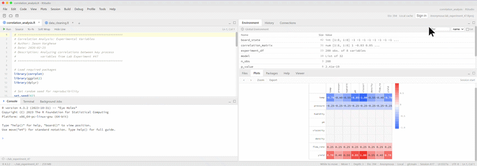

# RChess

> Chess disguised as an RStudio session.

The board renders as a fake `corrplot` heatmap. Moves go through an R-like console. At a glance it looks like normal analyst work.

**[Live demo →](https://rchess-cbf96.web.app)**



---

## What it actually is

A fully functional chess engine running in the browser, wrapped in a convincing RStudio UI skin. The correlation heatmap is the chess board — piece positions are encoded as cell values. The console accepts standard chess notation and fake R commands interchangeably.

Built as a joke that got out of hand.

---

## Features

- **Chess engine** — full legal move generation, check/checkmate/stalemate detection
- **Minimax AI** with alpha-beta pruning, runs entirely in-browser (no server)
- **Two notation styles** — SAN (`Nf3`, `Bxe5`, `O-O`) and coordinate (`e2e4`)
- **Elo tracking** — Google Sign-In with cloud profile persistence via Firestore
- **Anonymous mode** — local profile fallback if you skip sign-in
- **Boss mode** — one toggle to make it look even more like actual R work
- **RStudio chrome** — menu bar, toolbar, script editor pane, environment pane, status bar

---

## Console commands

```r
> move("e4")          # make a move
> move("Nf3")         # SAN notation works too
> board()             # print board state to console
> new_game()          # reset
> resign()            # resign current game
> help()              # list commands
> .rs_help()          # fake RStudio help (for appearances)
```

---

## Stack

| Layer | Tech |
|---|---|
| UI | React, Vite |
| Chess engine | Custom JS (minimax + alpha-beta pruning) |
| Auth + DB | Firebase Auth, Firestore |
| Hosting | Firebase Hosting |
| Elo system | Custom ELO calculation (`src/engine/elo.js`) |

---

## Local development

```bash
npm install
npm run dev
```

## Deploy

```bash
npm run build
npx firebase-tools deploy --only hosting
```

---

## License

MIT
